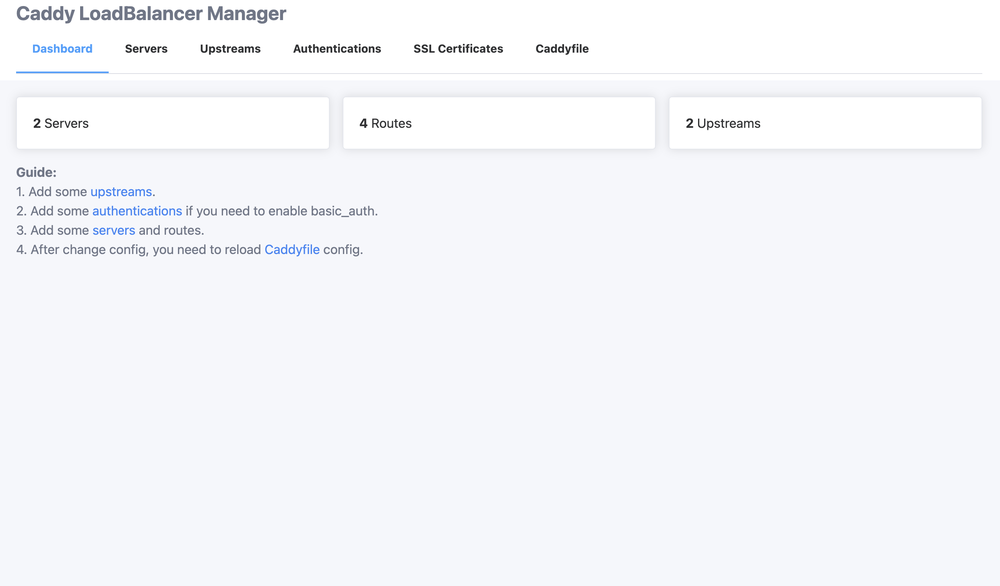
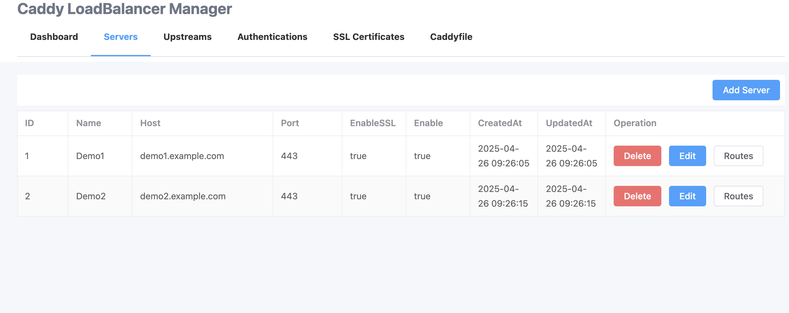
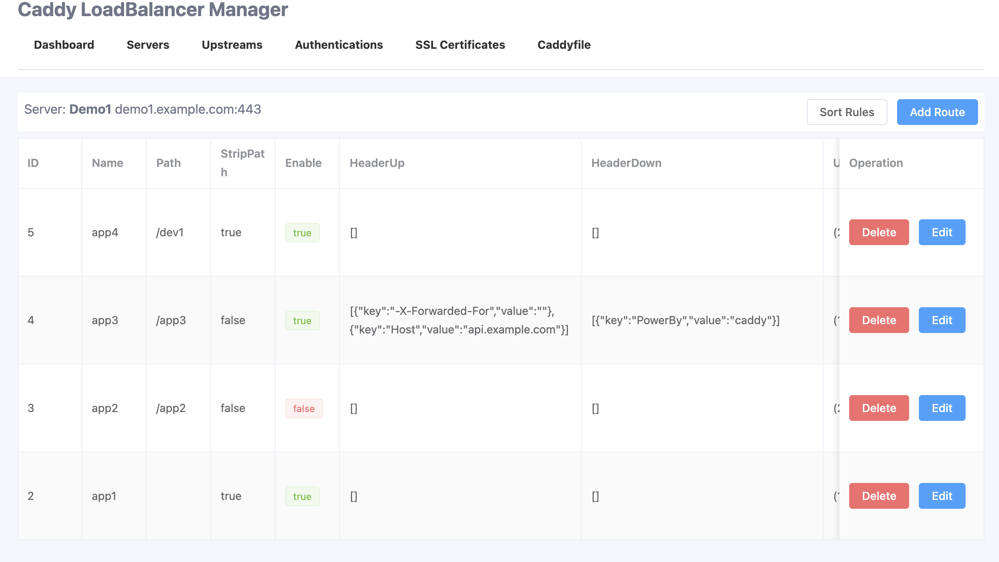
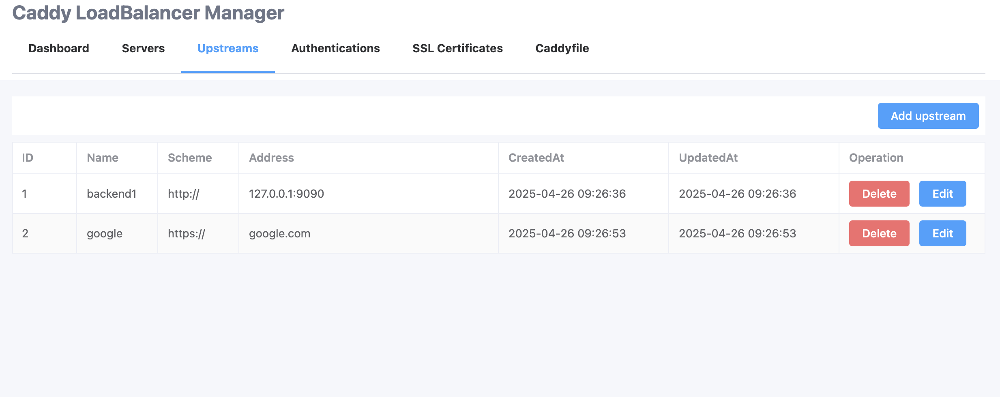
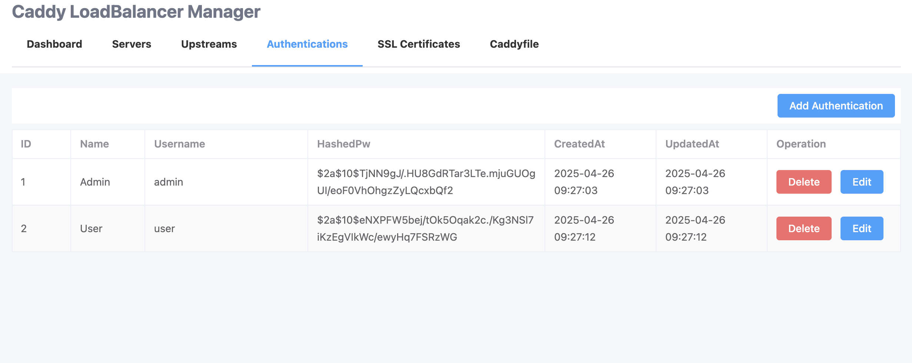
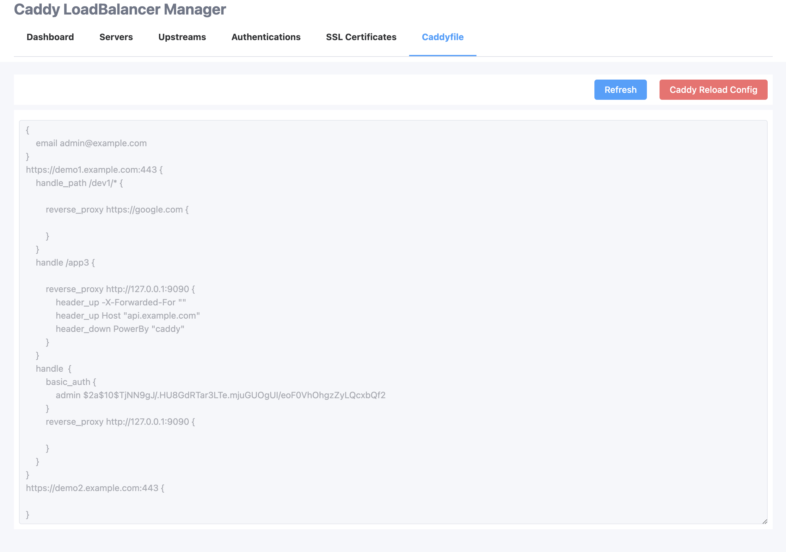

# caddy-lb-manager
A simple webui to manage caddy lb rules.


## Install
init database:

```
docker run -it --rm -v data_volume:/data wusuopu/caddy-lb-manager init_db
```

start service:

```
docker run -it -d -p 80:80 -p 443:443 -p 8080:8080 -v data_volume:/data wusuopu/caddy-lb-manager
```

open http://host:8080

## screenshots

Dashboard



Server Manage


Route Manage


Upstream Manage


Authentication Manage


Reload Caddyfile


## Environment Configuration

| Name | Description |
| --- | --- |
| PORT | webui port, default `8080` |
| DATABASE_TYPE | database type, support `sqlite` and `mysql`, default `sqlite` |
| DATABASE_DSN | default `/data/webui/production.db` |
| WEBUI_BASIC_AUTH_USER | basic auth for webui |
| WEBUI_BASIC_AUTH_PASSWORD | basic auth for webui |
| WEBUI_BASE_URL | |
| WEBUI_ENABLE_CLUSTER_MODE | enable cluster mode |
| CADDY_RELOAD_CMD | custom command to reload caddy config, will receive a parameter caddyfile path, default `caddy reload --config <Caddyfile>` |
| CADDY_TLS_EMAIL | default `admin@example.com` |


## High Availability
run instances in multiple cluster nodes.

1. use mysql database;
```
DATABASE_TYPE=mysql
DATABASE_DSN=<username>:<password>@tcp(<mysql_host>:<mysql_port>)/<db_name>?parseTime=true&multiStatements=true&&charset=utf8mb4&&loc=UTC
```

2. enable cluster mode
```
WEBUI_ENABLE_CLUSTER_MODE=true
```

3. mount `/data` to a NFS path, and share `/data` files to all nodes.
